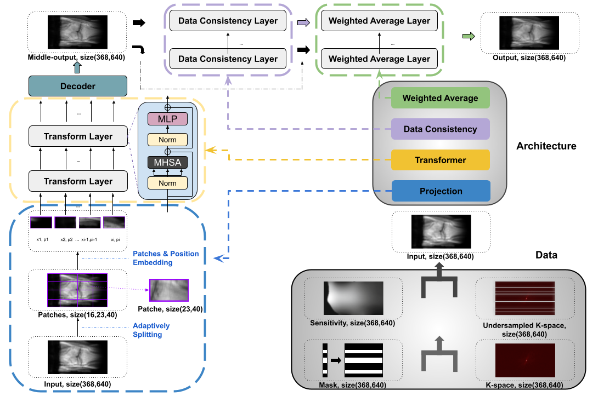

# AVS-Net

This repository contains an implementation of AVS-Net: Attention-based Variable Splitting Network for P-MRI Acceleration using PyTorch.

a. For a standalone knee dataset download, visit <https://huggingface.co/datasets/AVS-Net/knee_fast_mri> on `huggingface dataset`.

b. For the pre-trained inference model, visit <https://huggingface.co/AVS-Net/AVS-Net-Inference> on `huggingface model`.



Above outlines the architecture of our `AVS-Net` in the paper.

## Preliminary Steps

### 1. Clone the source code and dataset submodules

To conveniently clone both the source code and the dataset together, use submodules. The following command combines the dataset download and source code cloning in one step, effectively skipping the dataset downloading described above.

```bash
# Ensure git-lfs is installed (https://git-lfs.com)
git lfs install
git clone --recurse-submodules -j8 https://github.com/AVS-Net/AVS-Net.git
```

### 2. Install dependencies

Ensure Python version 3.8 or later is installed. Dependencies can be installed either using pip or conda:

```bash
pip install pytorch=1.7 torchvision matplotlib h5py scipy scikit-image tensorboard
```

or

```bash
conda install pytorch=1.7 torchvision torchaudio -c pytorch
conda install matplotlib h5py scipy scikit-image tensorboard
```

### 3.1 Simple setup

To run the AVS-Net on a general-purpose environment.

<details>

For example, with a single NVIDIA A100 80G graphic card on the amd64 platform can be used:

```bash
cd avs-net && CUDA_VISIBLE_DEVICES=0 python avs-net.py
```

#### Logging with TensorBoard

To monitor the process, visit localhost:6006 in your browser. Use the following command to start Tensorboard:

```bash
tensorboard --logdir tensorboard_log
```

</details>

### 3.2 Working on the BlueBEAR HPC

Please note that BlueBEAR is an IBM Power9 Series High Performance Computing system with ppcle-64 architecture, where we work on for this model. The following instructions are provided for reference.

<details>

#### General purpose usage on the terminal

After allocating requisite computational resources on a given node using `Slurm`, execute the following command:

```bash
module purge; module load bear-apps/2020b PyTorch &> /dev/null 
cd avs-net && CUDA_VISIBLE_DEVICES=0 python avs-net.py
```

Please be mindful that the connection can be interrupted at any time, which may result in the termination of the training process.

#### Utilizing Multiplexer with TMUX

For handling deep learning tasks in the background, especially during debugging, it is recommended to use `tmux` or `screen`.

Here we provide two different approaches to using `tmux`:

```bash
tmux new -s avs-net
module purge; module load bear-apps/2020b PyTorch &> /dev/null 
cd avs-net && CUDA_VISIBLE_DEVICES=0 python avs-net.py
```

or

```bash
tmux -CC # This will open a new terminal
module purge; module load bear-apps/2020b PyTorch &> /dev/null 
cd avs-net && CUDA_VISIBLE_DEVICES=0 python avs-net.py
# You can now close the laptop and return in 2 days
tmux -CC attach
```

#### Online debugging with CodeServer

It's more than a chanllege to debug a deep learning model on the `ppcle-64` enviroment. Use `Code-Sever` enforcement can benefit a lot for further experiments.

- Load module

```bash
module purge; module load bluebear;
module load module load bear-apps/2020b  &> /dev/null;
module load Python/3.8.6-GCCcore-10.2.0 &> /dev/null;
module load nodejs/14.16.1-GCCcore-10.2.0 &> /dev/null;
module load git/2.28.0-GCCcore-10.2.0-nodocs  &> /dev/null;
```

- Install and config

```bash
mkdir -p ~/.Library
npm install --global --prefix ~/.Library/ yarn
yarn global add typescript
yarn global add @google-cloud/logging
echo 'export PATH=~/.yarn/bin:$PATH' >> ~/.bashrc
```

- Modify sbatch script

```bash
cat > run_code_server.sh <<'EOT'
#!/bin/bash
module purge; module load bluebear;
module load bear-apps/2020b &> /dev/null;
module load PyTorch h5py nodejs git &> /dev/null;
export PASSWORD=duanj
work_dir="$HOME/special"
data_dir="$HOME/.vscode"
if  ! [ -d $work_dir ]; then
    mkdir $work_dir
fi
if  ! [ -d $data_dir ]; then
    mkdir $data_dir
fi

code-server \
    --auth=password \
--port=$port \
--disable-telemetry \
--extra-extensions-dir="$data_dir/extensions" \
--user-data-dir="$data_dir" \
"$work_dir"
EOT
```

</details>
